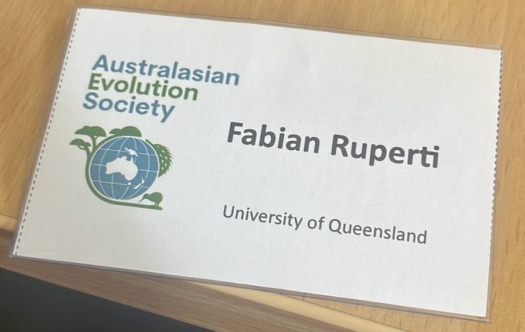
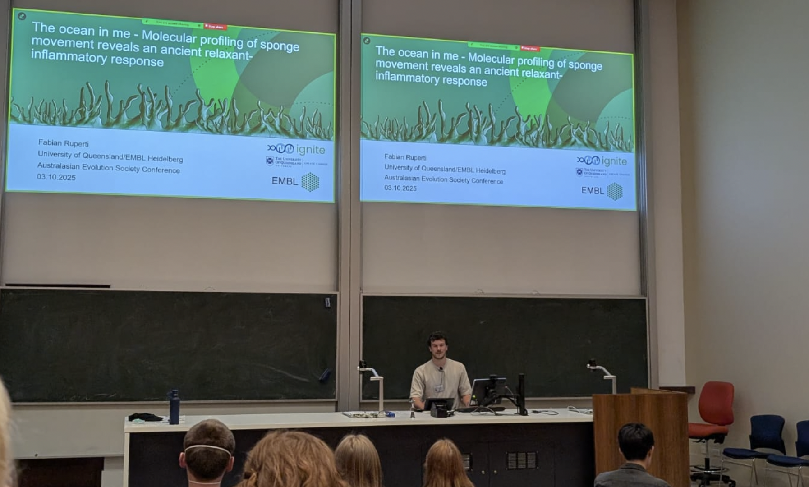

My first conference on Australian soil was right at my doorstep at the Univeristy of Queensland. The **Australasian Evolution Society** conference was a colorful mix of talks, spanning from theoretical definitions of phenotypic plasticity to the regional variations of snake venom toxicity. I for sure got my introduction to Australian flora and fauna.

I took this opportunity to talk *one last time* about my [main publication](/publications/spongeprot/) of my PhD work - the evolution of an ancient *relaxant-inflammatory* response in sponges that still persists in our blood vessels today.

  
  
  <!-- add more as needed -->

<!--more-->
