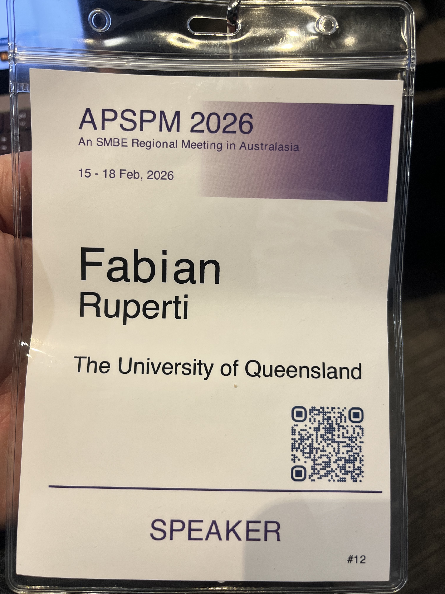

This marks the end of my 2026 beginning-of-the-year conference marathon. This time, I talked about 'old' work that was [published](/publications/journal-article-2) during my PhD together with Nikolaos Papadopoulos, Milot Mirdita and Martin Steinegger. Back then, AlphaFold and Foldseek *just* came out and we came up with a pipeline that used structural similarity (rather sequence similarity) to detect homologs for functional transfer to our sponge transcriptome. 

The last thing I did was to try to convince the field that something like a *structural* or *sequence homolog* does not exist. Either a pair of proteins share a common ancestor (and therefore homologs) or they don't. Sequence or structure similarity is just a quantitative measure for evidence for the hypothesis of ancestry. Makes sense?

  
  <!-- add more as needed -->

<!--more-->
