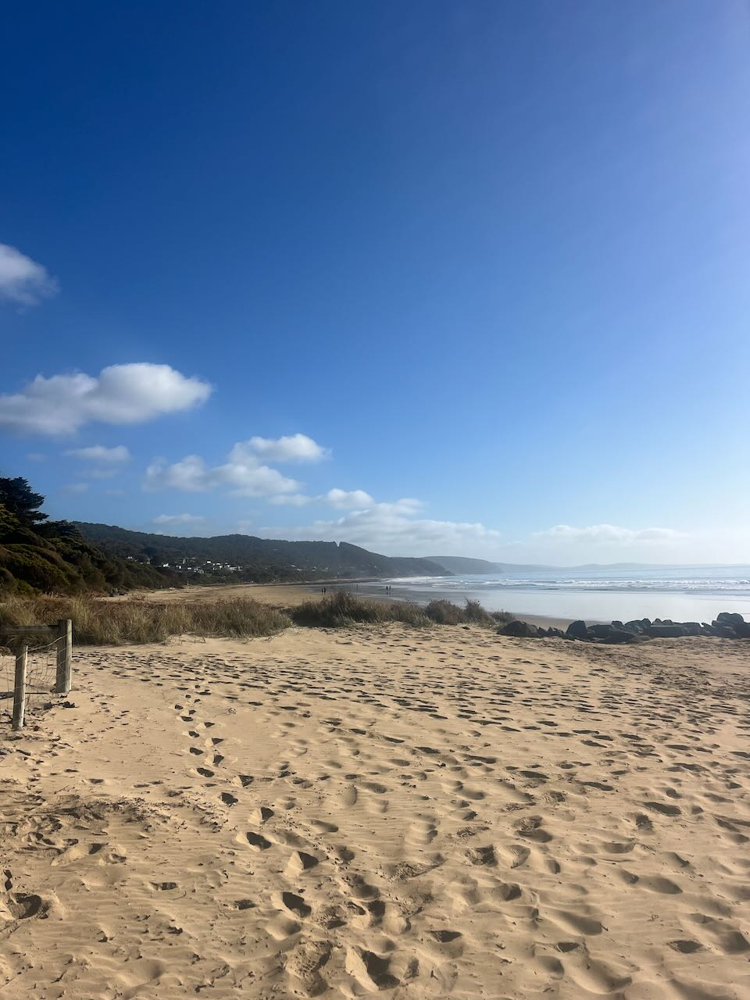

Finally - my first **Lorne Proteomics Conference**! I have heard rumors, even back in Germany, about the meeting, the place Lorne with its beautiful beach, and the conference party. And I was not disappointet. I was able to meet all the 'big names' in proteomics in Australia and beyond and had opportunity to talk about [Dolittle](/projects/dolittle/). Awesome feedback, great discussions, new friends and looking forward to next year! 

  
  <!-- add more as needed -->

<!--more-->
