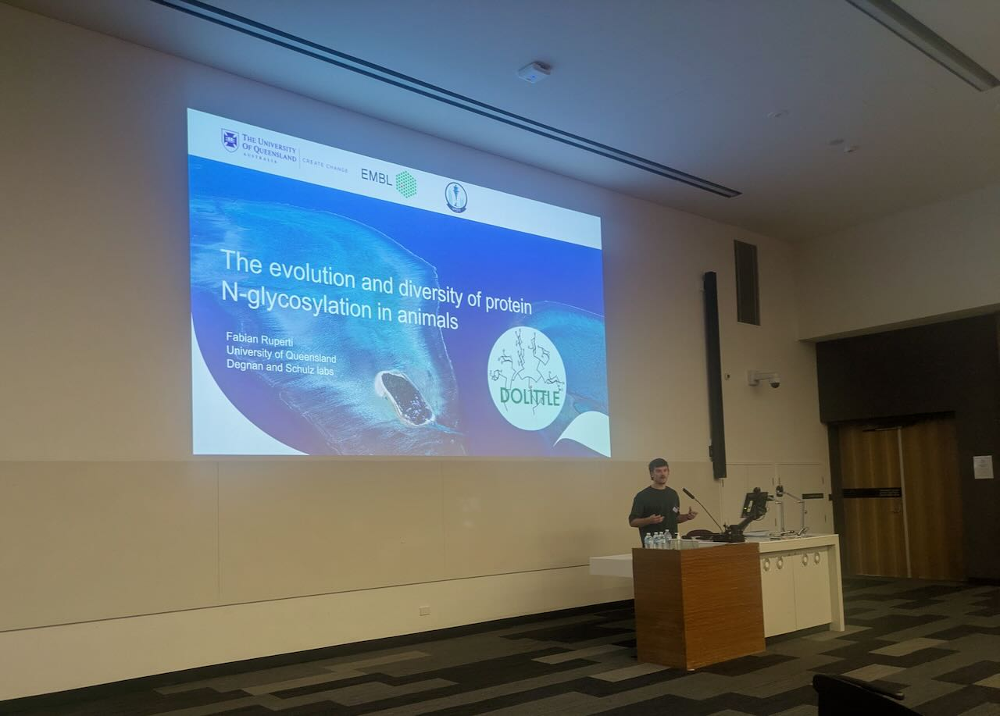
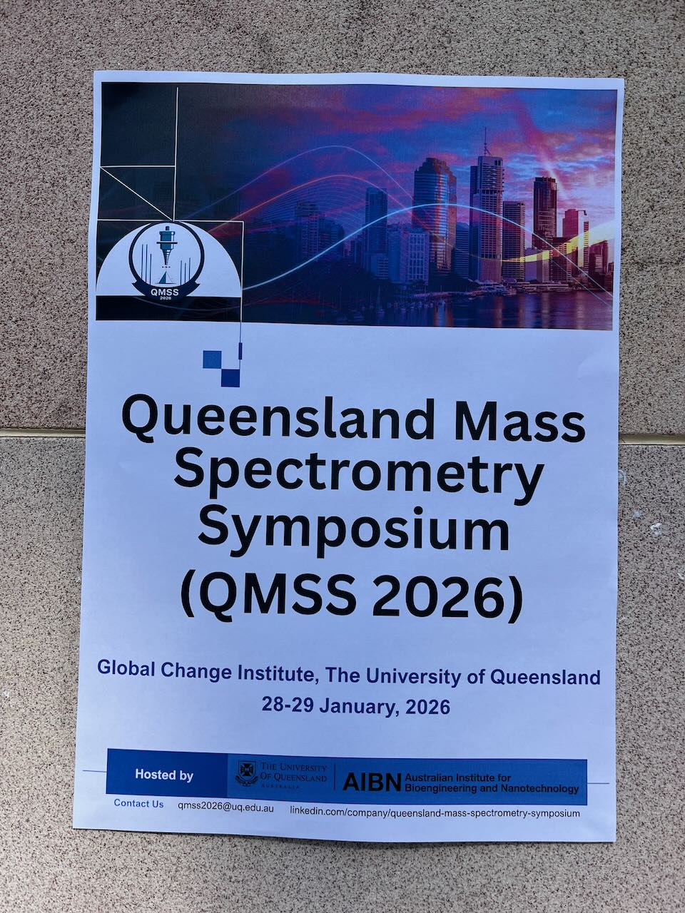

What a lovely bunch of people! My first impression of the **Queensland Mass Spectrometry crowd**. In two packed days, everyone in Queensland (and more) who is connected by one shared method - mass spectrometry - gathered and shared their stories. From proteomics, glycomics, lipidomics, metabolomics to health, nutrition and evolution, there was a talk for everyone

I took this opportunity to talk about [Dolittle](/projects/dolittle/) and to convince people that we need to look beyond the model species horizont. I think my audicence agreed, rewarding me with a price for 2nd best EMCR (early-mid career researchers) oral presentation!

  
  
  <!-- add more as needed -->

<!--more-->
