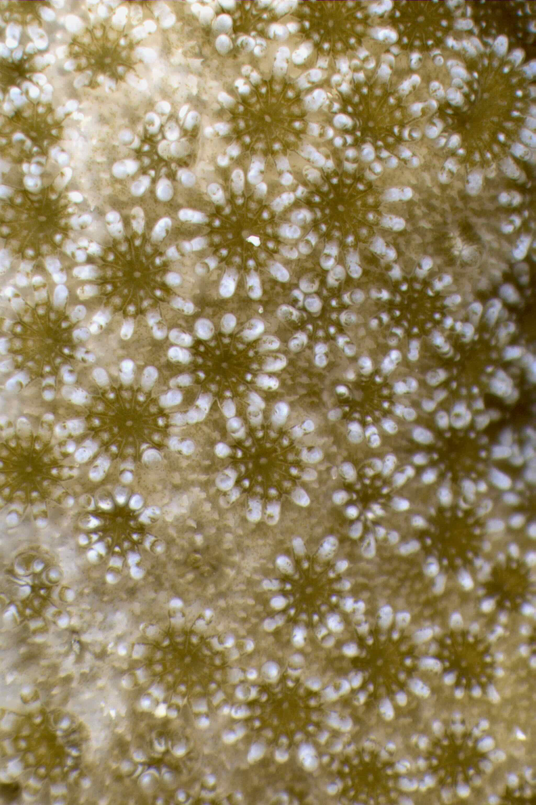
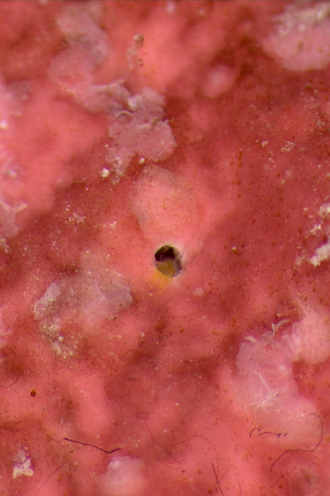
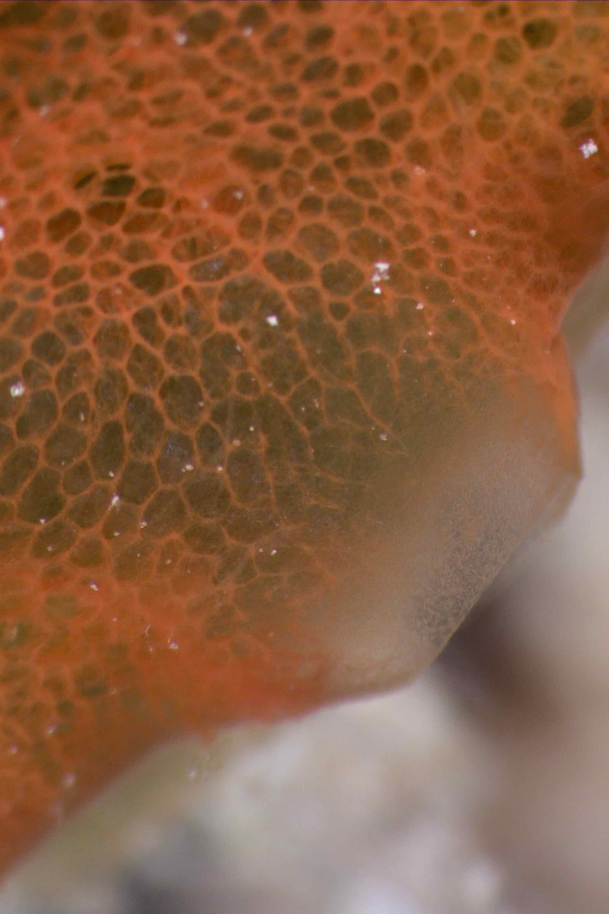
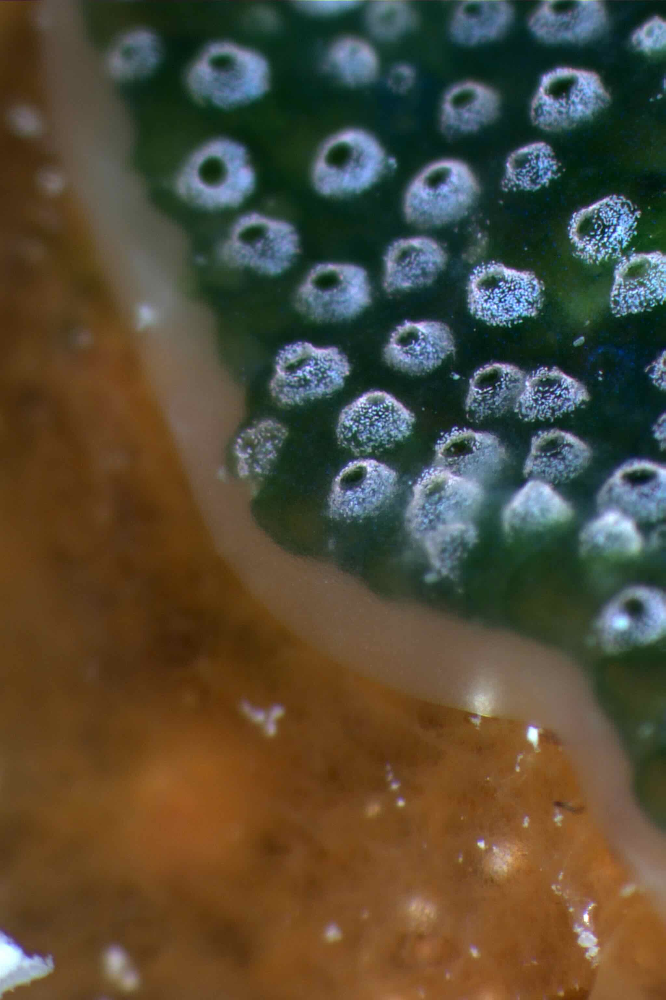
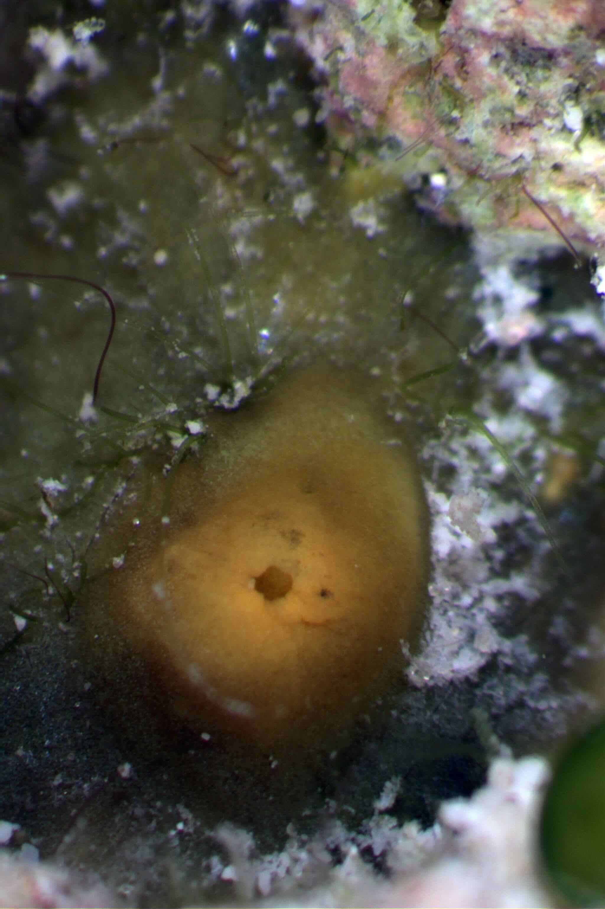
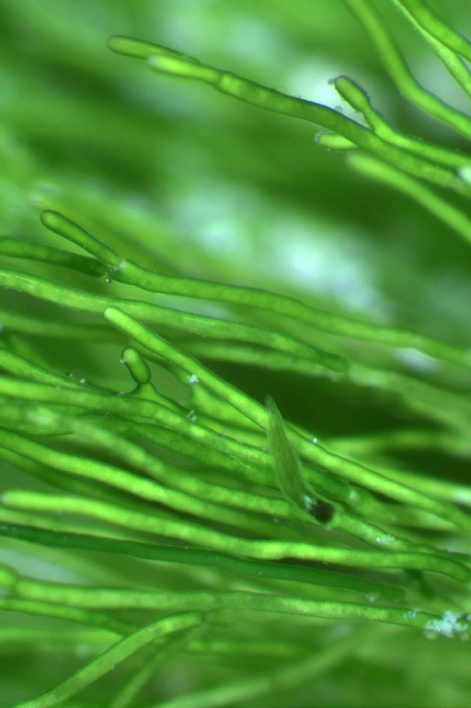

My first time sampling at Heron Island reef was a blast. Heron Island is a coral cay (a small, sandy island on top of a coral reef) in the southern Great Barrier Reef. The University of Queensland runs a successful [marine research station](https://heron-island.research.uq.edu.au) with amazing staff around. 

This trip was my first time collecting my main model species, the coral reef sponge *Amphimedon queenslandica* with my wonderful collegues Oceane and Eve, who taught me everything about collection, spawning and larval collection. Additionally, I was able to do some sponge cell reagreggation experiments for my [GlySelf](/projects/glyself/) project. 

In our (little) free time, I was mainly snorkeling and exploring live rock under the microscope - some pictures posted below! 

  
  
  
  
  
  
  <!-- add more as needed -->

<!--more-->
